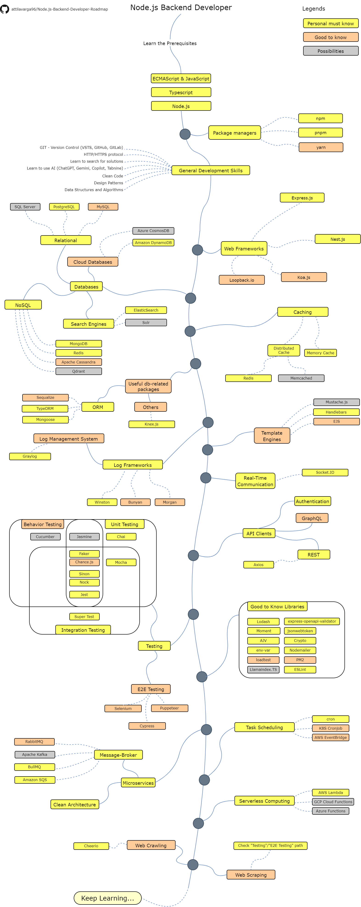

# Node.js Backend Developer Roadmap

*Roadmap to becoming a [Node.js](https://nodejs.org/en) Backend Developer*

Below you can find a chart demonstrating the paths that you can take and the libraries that you would want to learn to become a Node.js Backend Developer. I made this chart as a tip for everyone who asks me, "What should I learn next as a Node.js Backend Developer?"

## 1. Table of Contents

- [1. Table of Contents](#1-table-of-contents)
- [2. Disclaimer](#2-disclaimer)
- [3. Give a Star! :star](#3-give-a-star-star)
- [4. Roadmap](#4-roadmap)
- [5. Resources](#5-resources)
  - [5.1. Prerequisites](#51-prerequisites)
  - [5.2. General Development Skills](#52-general-development-skills)
  - [5.3. Web Frameworks](#53-web-frameworks)
  - [5.4. Databases](#54-databases)
    - [5.4.1. Relational](#541-relational)
    - [5.4.2. Cloud Databases](#542-cloud-databases)
    - [5.4.3. Search Engines](#543-search-engines)
    - [5.4.4. NoSQL](#544-nosql)
  - [5.5. Useful db-related packages](#55-useful-db-related-packages)
    - [5.5.1. Object-Relational Mapping (ORM)](#551-object-relational-mapping-orm)
    - [5.5.2. Others](#552-others)
  - [5.6. Caching](#56-caching)
    - [5.6.1. Distributed Cache](#561-distributed-cache)
    - [5.6.2. Memory Cache - Better to implement manually](#562-memory-cache---better-to-implement-manually)
  - [5.7. Logging](#57-logging)
    - [5.7.1. Log Frameworks](#571-log-frameworks)
    - [5.7.2. Log Management System](#572-log-management-system)
  - [5.8. Template Engines](#58-template-engines)
  - [5.9. Real-Time Communication](#59-real-time-communication)
  - [5.10. API Clients](#510-api-clients)
    - [5.10.1. Authentication](#5101-authentication)
    - [5.10.2. REST](#5102-rest)
    - [5.10.3. GraphQL](#5103-graphql)
  - [5.11. Testing](#511-testing)
    - [5.11.1. Unit, Behavior, Integration Testing](#5111-unit-behavior-integration-testing)
      - [1. Test Data Generation](#1-test-data-generation)
      - [2. Mocking](#2-mocking)
      - [3. Jest](#3-jest)
    - [5.11.2. Unit, Behavior Testing](#5112-unit-behavior-testing)
    - [5.11.3. Unit, Integration Testing](#5113-unit-integration-testing)
    - [5.11.4. Unit Testing](#5114-unit-testing)
    - [5.11.5. Behavior Testing](#5115-behavior-testing)
    - [5.11.6. Integration Testing](#5116-integration-testing)
  - [5.12. Good to Know](#512-good-to-know)
  - [5.13. MicroServices](#513-microservices)
    - [5.13.1. Message-Broker](#5131-message-broker)
    - [5.13.2. Clean Architecture](#5132-clean-architecture)
  - [5.14. Task Scheduling](#514-task-scheduling)
  - [5.15. Serverless Computing](#515-serverless-computing)
  - [5.16. Web Crawling \& Scraping](#516-web-crawling--scraping)
    - [5.16.1. Crawling](#5161-crawling)
    - [5.16.2. Scraping](#5162-scraping)
- [6. Wrap Up](#6-wrap-up)
- [7. Contribution](#7-contribution)
- [8. License](#8-license)

## 2. Disclaimer

The purpose of this roadmap is to give you an idea about the landscape. The road map will guide you if you are confused about what to learn next, rather than encouraging you to pick what is hip and trendy. You should grow some understanding of why one tool would be better suited for some cases than the other and remember hip and trendy does not always mean best suited for the job.

## 3. Give a Star! :star

If you like or are using this project to learn or start your solution, please give it a star. Thanks!

## 4. Roadmap

## 5. Resources

### 5.1. Prerequisites

- [JavaScript](https://javascript.info/)
- [TypeScript](https://www.typescriptlang.org/docs/)
- Package managers:
  - [NPM](https://docs.npmjs.com/)
  - [PNPM](https://pnpm.io/)
  - [Yarn](https://yarnpkg.com/)
- [Node.js](https://nodejs.org/en/docs/)
- [ECMAScript](https://www.w3schools.com/js/js_versions.asp)

### 5.2. General Development Skills

- Learn GIT, create a few repositories on GitHub, share your code with other people
- Know HTTP(S) protocol, request methods (GET, POST, PUT, PATCH, DELETE, OPTIONS)
- Don't be afraid of using Google, [Power Searching with Google](http://www.powersearchingwithgoogle.com/)
- Learn to use AI (ChatGPT, Gemini, Copilot, Tabnine)
- [Clean Code](https://www.oreilly.com/library/view/clean-code-a/9780136083238/)
- [Design Patterns](https://refactoring.guru/)
- Study a few books or courses about algorithms and data structures and practice with online tools, for example [HackerRank](https://www.hackerrank.com/)

### 5.3. Web Frameworks

- [Express.js](https://expressjs.com/)
- [Nest.js](https://nestjs.com/)
- [Koa.js](https://koajs.com/)
- [Loopback.io](https://loopback.io/)

### 5.4. Databases

#### 5.4.1. Relational

- [SQL Server](https://www.microsoft.com/en-us/sql-server/sql-server-2017)
- [PostgreSQL](https://www.postgresql.org/)
- [MySQL](https://www.mysql.com/)

#### 5.4.2. Cloud Databases

- [Azure CosmosDB](https://docs.microsoft.com/en-us/azure/cosmos-db)
- [Amazon DynamoDB](https://aws.amazon.com/dynamodb/)

#### 5.4.3. Search Engines

- [ElasticSearch](https://www.elastic.co/)
- [Solr](http://lucene.apache.org/solr/)

#### 5.4.4. NoSQL

- [MongoDB](https://www.mongodb.com/)
- [Redis](https://redis.io/)
- [Apache Cassandra](http://cassandra.apache.org/)
- [Qdrant](https://qdrant.tech/)

### 5.5. Useful db-related packages

#### 5.5.1. Object-Relational Mapping (ORM)

- [Sequalize (SQL)](https://sequelize.org/)
- [TypeORM (Universal)](https://typeorm.io/)
- [Mongoose (MongoDB)](https://mongoosejs.com/)

#### 5.5.2. Others

- [Knex (SQL)](https://knexjs.org/)

### 5.6. Caching

#### 5.6.1. Distributed Cache

- [Redis](https://redis.io/)
- [Memcached](https://memcached.org/)

#### 5.6.2. Memory Cache - Better to implement manually

### 5.7. Logging

#### 5.7.1. Log Frameworks

- [Winston](https://www.npmjs.com/package/winston)
- [Bunyan](https://www.npmjs.com/package/bunyan)
- [Morgan](https://www.npmjs.com/package/morgan)

#### 5.7.2. Log Management System

- [Graylog](https://graylog.org/)

### 5.8. Template Engines

- [Mustache.js](https://www.npmjs.com/package/mustache)
- [Handlebars](https://handlebarsjs.com/)
- [EJS](https://ejs.co/)

### 5.9. Real-Time Communication

- [Socket.IO](https://socket.io/)

### 5.10. API Clients

#### 5.10.1. [Authentication](https://dev.to/rowsanali/authentication-and-authorization-in-nodejs-a-comprehensive-guide-4jl6)

#### 5.10.2. [REST](https://aws.amazon.com/what-is/restful-api/)

- [Axios](https://www.npmjs.com/package/axios)

#### 5.10.3. [GraphQL](https://graphql.org/)

### 5.11. Testing

#### 5.11.1. Unit, Behavior, Integration Testing

##### 1. Test Data Generation

- [Faker](https://fakerjs.dev/)
- [Chance.js](https://chancejs.com/)

##### 2. Mocking

- [Sinon](https://sinonjs.org/)
- [Nock](https://www.npmjs.com/package/nock)

##### 3. [Jest](https://jestjs.io/)

#### 5.11.2. Unit, Behavior Testing

- [Jasmine](https://jasmine.github.io/)

#### 5.11.3. Unit, Integration Testing

- [Mocha](https://mochajs.org/)

#### 5.11.4. Unit Testing

- [Chai](https://www.chaijs.com/)

#### 5.11.5. Behavior Testing

- [Cucumber](https://cucumber.io/)

#### 5.11.6. Integration Testing

- [Super Test](https://www.npmjs.com/package/supertest)

### 5.12. Good to Know

- [Lodash](https://lodash.com/)
- [Moment](https://momentjs.com/)
- [AJV](https://ajv.js.org/)
- [env-var](https://www.npmjs.com/package/env-var)
- [express-openapi-validator](https://www.npmjs.com/package/express-openapi-validator)
- [jsonwebtoken](https://github.com/auth0/node-jsonwebtoken)
- [Crypto](https://nodejs.org/api/crypto.html)
- [Nodemailer](https://www.npmjs.com/package/nodemailer)
- [ESLint](https://www.npmjs.com/package/eslint)
- [loadtest](https://www.npmjs.com/package/loadtest)
- [PM2](https://www.npmjs.com/package/pm2)
- [Llamaindex.TS](https://www.npmjs.com/package/llamaindex)

### 5.13. MicroServices

#### 5.13.1. Message-Broker

- [RabbitMQ](https://www.rabbitmq.com/tutorials/tutorial-one-javascript.html)
- [Apache Kafka](https://kafka.js.org/)
- [BullMQ](https://docs.bullmq.io/)
- [Amazon SQS](https://aws.amazon.com/sqs/)

#### 5.13.2. [Clean Architecture](https://www.oreilly.com/library/view/clean-architecture-a/9780134494272/)

### 5.14. Task Scheduling

- [cron](https://www.npmjs.com/package/cron)
- [K8S Cronjob](https://kubernetes.io/docs/concepts/workloads/controllers/cron-jobs/)
- [AWS EventBridge](https://aws.amazon.com/eventbridge/)

### 5.15. Serverless Computing

- [AWS Lambda](https://aws.amazon.com/pm/lambda/)
- [GCP Cloud Functions](https://cloud.google.com/functions)
- [Azure Functions](https://azure.microsoft.com/en-us/products/functions)

### 5.16. Web Crawling & Scraping

#### 5.16.1. Crawling

- [Cheerio](https://cheerio.js.org/)

#### 5.16.2. Scraping

- Check the E2E Testing-related packages

## 6. Wrap Up

If you think the roadmap can be improved, please do open a PR with any updates and submit any issues. Also, I will continue to improve this, so you might want to star this repository to revisit.

Idea from : [Node.js Developer Roadmap](https://github.com/aliyr/Nodejs-Developer-Roadmap)

## 7. Contribution

The roadmap is built using [Draw.io](https://www.draw.io/). Project file can be found at `Node.js-backend-developer-roadmap.drawio.png` file. To modify it, open draw.io, click **Open Existing Diagram** and choose `drawio.png` file with project. It will open the roadmap for you. Update it, upload and update the image in readme and create a PR (export as png with 200% and overwrite the original drawio.png). Don't forget to update the README.md if it is necessary.

- Open a pull request with improvements
- Discuss ideas in issues
- Spread the word

## 8. License

